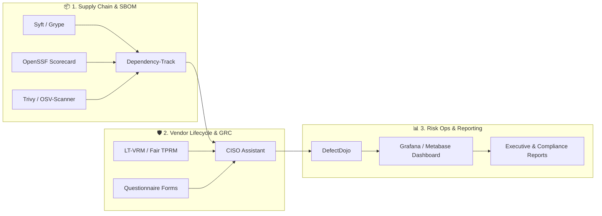

# Awesome Third-Party Risk Exchange 🛡️

  

  
  
  
  
  
  
  

---

## 🎯 Overview & Ecosystem

A curated directory of **Third-Party Risk Management (TPRM)**, **Vendor Risk Management (VRM)**, **Security Ratings Platforms**, and **Software Supply Chain Risk Tools**.

Whether you are building an enterprise vendor risk program, evaluating commercial SaaS security exchange networks, or deploying self-hosted open-source GRC and SBOM scanners, this guide tracks the best solutions for outside-in cyber ratings, questionnaire automation, continuous monitoring, and regulatory compliance (**NIST CSF**, **ISO 27001**, **SOC 2**, **DORA**, **GDPR**, **HIPAA**).

---

## 📑 Table of Contents

- [🏢 SaaS & Hosted TPRM Platforms](#-saashosted-tprm-platforms)
- [💻 Open-Source TPRM & Supply Chain Projects](#-open-source-tprm--supply-chain-projects)
- [🏗️ Building a Modern Open-Source TPRM Stack](#️-building-a-modern-open-source-tprm-stack)
- [🤝 How to Contribute](#-how-to-contribute)
- [⭐ Star History](#-star-history)
- [📜 Disclaimer](#-disclaimer)

---

## 🏢 SaaS/Hosted TPRM Platforms

Enterprise commercial third-party risk exchange networks, security posture rating providers, and automated questionnaire exchange hubs.

*Sorted by Company Size (Market Cap / Valuation / Total Capitalization, Descending)*

| Platform | Company Size (Valuation / Revenue) | Description | Starting Pricing | Free Tier / Free Trial Limits |
| :--- | :--- | :--- | :--- | :--- |
| **[RiskRecon (Mastercard)](https://www.riskrecon.com/)** | **~$500B+ Market Cap** (Mastercard Parent) / $150M Acquisition | Cyber risk rating and continuous monitoring platform focused on actionable third-party security insights and risk-prioritized findings. | Starts at ~$10,000/yr (base vendor portfolio monitoring tier) | **Free trial**: 30-day free trial with cyber risk rating reports for up to 50 vendors, own-domain rating report, and Risk Priority Matrix access. |
| **[OneTrust Vendorpedia](https://www.onetrust.com/)** | **~$4.5B Valuation** (Series C) / ~$500M+ ARR | Comprehensive vendor risk, compliance, and privacy management platform with global assessment exchange libraries and continuous monitoring integrations. | Starts at $10,000/yr (minimum annual contract floor; median contract ~$11,835/yr) | **Free trial**: 14-day pilot evaluation with select TPRM module workflows upon sales approval + free standalone questionnaire response tools (no free-forever platform tier). |
| **[BitSight](https://www.bitsight.com/)** | **~$2.4B Valuation** / >$200M ARR | Cyber risk ratings platform focused on continuous monitoring of third-party and internal security posture with financial-impact insights and executive benchmarking. | Starts at ~$21,825/yr (SMB tier; median enterprise contracts range $25,000–$50,000+/yr) | **Free forever plan**: Access to Trust Management Hub (TMH) & 1 complimentary company cyber risk rating report; 14-day evaluation trial on request. |
| **[Prevalent](https://www.prevalent.net/)** | **~$1.55B Enterprise Value** (Mitratech Parent) | Enterprise third-party risk management platform covering vendor onboarding, automated assessments, continuous threat monitoring, and regulatory risk reporting. | Starts at ~£3,625/yr (~$4,600/yr) per basic G-Cloud unit / ~$25,000/yr for core enterprise TPRM suite | **Free trial**: 30-day guided proof-of-concept trial including select vendor risk assessments upon demo approval (no free-forever plan). |
| **[SecurityScorecard](https://securityscorecard.com/)** | **~$1.0B Valuation** (Unicorn) / ~$144M ARR | Leading security ratings platform providing continuous outside-in scores, threat intelligence, automated questionnaires (Atlas), and portfolio-level third-party risk visibility. | Starts at ~$20,000/yr (core portfolio monitoring; single-seat base licenses start around $2,400/yr) | **Free forever plan**: 1 company domain self-monitoring (unlimited users); 14-day free trial of Business plan (full scoring & assessments). |
| **[ProcessUnity](https://www.processunity.com/)** | **~$500M+ Est. Valuation** / ~$35M+ ARR (Marlin Equity) | Enterprise third-party risk and GRC platform supporting comprehensive vendor lifecycle management, automated due diligence assessments, and compliance workflows. | Starts at ~$25,000/yr (base TPRM package; tiered Silver/Gold/Platinum options scale by vendor volume) | **Free trial**: 14-to-30-day proof-of-concept evaluation sandbox with sample vendor workflows upon demo request (no free-forever plan). |
| **[UpGuard](https://www.upguard.com/)** | **~$160M+ Est. Valuation** ($75M Series C) / ~$21M ARR | Comprehensive TPRM and attack-surface management platform with automated vendor ratings, continuous monitoring, security questionnaires, and breach risk insights. | Starts at $1,750/mo ($21,000/yr billed annually) for Standard tier (monitors up to 50 vendors) | **Free forever plan**: Monitor up to 5 vendors with Trust Exchange AI questionnaire access; 14-day full-feature trial (no credit card required). |
| **[Panorays](https://panorays.com/)** | **~$100M+ Est. Valuation** ($62M Total Funding) / ~$13M ARR | Automated third-party security risk management platform combining external scanning with collaborative assessment workflows and custom vendor context. | Starts at ~$15,000/yr (base vendor monitoring tier; mid-market deployments range $25,000–$50,000/yr) | **Free forever plan**: Starter plan with own security posture score & shareable Trust Center profile; 14-day trial with up to 5 vendor assessments. |
| **[Whistic](https://www.whistic.com/)** | **~$100M+ Est. Valuation** ($50M+ Total Funding) / ~$12M ARR | Proactive vendor assessment and trust exchange platform focused on standardized security questionnaires, evidence collection, and AI-accelerated due diligence. | Starts at ~$15,000 – $20,625/yr (average contract ~$20,625/yr via Vendr for standard TPRM tiers) | **Free forever plan**: Whistic Basic Profile (publish security profile to Trust Catalog, 40+ questionnaire templates, 3 profile shares/mo); 14-day trial for automation. |
| **[Black Kite](https://blackkite.com/)** | **~$75M+ Est. Valuation** ($36M Total Funding) / ~$10M ARR | Third-party cyber risk platform offering non-invasive technical ratings, vulnerability insights, ransomware susceptibility index (RSI), and FAIR risk quantification for vendor portfolios. | Starts at ~$25,000/yr (median annual contract ~$29,160/yr; per-vendor/per-tier pricing with unlimited user seats) | **Free trial**: 14-day guided proof-of-concept / sandbox trial with sample vendor portfolio assessment (no free-forever plan). |

---

## 💻 Open-Source TPRM & Supply Chain Projects

Community-driven, self-hosted, and transparent open-source tools for Vendor Risk Management, GRC compliance, Software Bill of Materials (SBOM), and software supply chain dependency security.

*Sorted by GitHub Star Count (Descending)*

1. **[Trivy](https://github.com/aquasecurity/trivy)**   
   Comprehensive open-source security scanner for container images, file systems, Git repositories, virtual machine images, and software supply chain dependencies. Detects CVEs, misconfigurations, and sensitive data exposures.

2. **[OSV-Scanner](https://github.com/google/osv-scanner)**   
   Official Google vulnerability scanner that uses the Open Source Vulnerabilities (OSV) distributed database to audit third-party open-source dependencies and supply chain risks against real-world CVEs.

3. **[Grype](https://github.com/anchore/grype)**   
   Fast vulnerability scanner for container images and filesystems, enabling comprehensive third-party software component risk auditing and continuous compliance checking.

4. **[Syft](https://github.com/anchore/syft)**   
   CLI tool and Go library for generating detailed Software Bill of Materials (SBOM) in SPDX, CycloneDX, and custom JSON formats to inspect third-party supply chain components.

5. **[OpenSSF Scorecard](https://github.com/ossf/scorecard)**   
   Automated security tool by the Open Source Security Foundation that assesses security health metrics, maintenance risks, and software supply-chain vulnerabilities of open-source dependencies.

6. **[Cosign](https://github.com/sigstore/cosign)**   
   Sigstore open-source standard for container signing, cryptographic verification, and provenance checking to ensure tamper-free third-party software artifacts.

7. **[DefectDojo](https://github.com/DefectDojo/django-DefectDojo)**   
   Leading open-source vulnerability management and DevSecOps platform with comprehensive capabilities for vendor assessments, compliance tracking, metrics, and security reporting.

8. **[CISO Assistant](https://github.com/intuitem/ciso-assistant-community)**   
   Modern open-source GRC and vendor risk management platform supporting compliance framework mappings (ISO 27001, NIST CSF, SOC 2, DORA, NIS2) and third-party risk assessments.

9. **[Dependency-Track](https://github.com/DependencyTrack/dependency-track)**   
   Intelligent OWASP Component Analysis platform that allows organizations to track third-party component usage, identify supply chain vulnerabilities, and manage enterprise SBOMs at scale.

10. **[GUAC (Graph for Understanding Artifact Composition)](https://github.com/guac-sec/guac)**   
    Open-source supply chain knowledge graph that ingests software security metadata (SLSA, SBOM, Scorecard) to surface transitive third-party relationships and blast radius.

11. **[in-toto](https://github.com/in-toto/in-toto)**   
    Comprehensive framework to verify the end-to-end integrity and provenance of software supply chains from development to deployment across external dependencies.

12. **[RiskHub](https://github.com/W1z4rd1c4/RiskHub)**   
    Open-source risk operations platform for governed risks, controls, KRIs, vendor inventories, review approvals, and compliance evidence management.

13. **[LT-VRM](https://github.com/learntprm-design/lt-vrm)**   
    Free and open-source Third-Party / Vendor Risk Management platform supporting questionnaires, scoring workflows, contract tracking, and vendor self-service portals.

14. **[Fair TPRM](https://github.com/fairtprm/Fair-TPRM)**   
    Open-source TPRM and GRC platform combining vendor lifecycle management, risk assessments, FAIR financial quantification, and continuous security monitoring in a self-hosted package.

---

## 🏗️ Building a Modern Open-Source TPRM Stack

For organizations looking to avoid vendor lock-in and high annual licensing costs, a modern open-source TPRM architecture can be composed using:

- **Core Assessment & Registry**: Deploy **CISO Assistant**, **Fair TPRM**, or **LT-VRM** for maintaining vendor inventories, risk tiering, and tracking questionnaire assessments.
- **Software Supply Chain Risk**: Enrich vendor audits with **Dependency-Track**, **Syft**, and **OpenSSF Scorecards** to evaluate open-source dependency health and transitive software risks.
- **Continuous Operations**: Aggregate findings into **DefectDojo** or **RiskHub** and visualize risk posture through open analytics dashboards (**Grafana**, **Metabase**).

---

## 🤝 How to Contribute

Contributions are warmly welcome! To propose a new SaaS platform or open-source tool:

1. 🍴 **Fork** this repository.
2. ✍️ **Add/Update** entries in `README.md` maintaining the existing tabular format, pricing accuracy, and star badges.
3. 🔍 **Verify**: Include links, precise descriptions, up-to-date starting tiers, and free trial specifications.
4. 🚀 **Submit PR** with a brief summary of the addition.

---

## ⭐ Star History

---

## 📜 Disclaimer

- This is a **community-curated list** — not exhaustive and not an endorsement of any commercial platform or open-source software.
- Third-Party Risk Management involves legal, contractual, and regulatory obligations (e.g., GDPR, DORA, HIPAA, SOC 2). Open-source and SaaS ratings are indicators, not legal guarantees.
- Always validate critical vendor decisions with appropriate due diligence, legal counsel, and contractual protections.

---

  <b>Built with ❤️ for Security, GRC, and Procurement teams managing modern vendor risk.</b> 
  <i>Making third-party risk intelligence accessible, transparent, and community-powered.</i>

